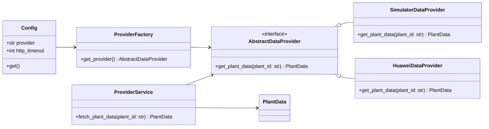

# ARCHITECTURE

This document is maintained throughout development and describes the current project architecture, folder structure, component responsibilities, class diagram, and architectural decisions.

-- Update after each prompt --

## Project purpose

A standalone development tool that simulates a solar monitoring API so another system can integrate with a simulated solar plant before the real Huawei FusionSolar Northbound API is available. The simulator will be replaceable by a real Huawei provider with minimal changes.

## Folder structure

app/
  __init__.py         - Application factory (FastAPI app creation, router registration, startup/shutdown hooks)
api/
  routes.py           - API routes (endpoints implemented)
  schemas.py          - API request/response Pydantic models
core/
  logger.py           - Logging setup
  errors.py           - Core exceptions
providers/
  abstract.py         - AbstractDataProvider interface (contract for providers)
  simulator.py        - Simulator provider (implemented)
  huawei.py           - Huawei provider (placeholder only)

services/
  provider_factory.py - Factory to select/create and cache provider instances
  provider_service.py - Service layer that uses providers to fetch plant data
  auth_service.py     - In-memory fake authentication service
models/
  plant.py            - Pydantic models for plant and production data
config.py             - Application configuration via pydantic BaseSettings
main.py               - Application entrypoint (creates app, sets up logging)
requirements.txt      - Python dependencies
README.md             - Project overview and setup

## Mermaid class diagram

## Component responsibilities

- Config (config.py)
  - Provide typed configuration via environment variables.
  - Central place for selecting which provider to use in runtime (e.g. "simulator" or "huawei").

- core/logger.py
  - Configure Python logging consistently across the application.

- models/plant.py
  - Strongly typed Pydantic models representing plant metrics returned by providers.

- providers/abstract.py
  - Define the AbstractDataProvider interface used by the rest of the system.

- providers/simulator.py
  - Concrete simulator implementation that maintains an in-memory plant and updates it periodically.

- providers/huawei.py
  - Placeholder implementation for the real Huawei provider. Not implemented (stub only).

- services/provider_factory.py
  - Select and instantiate the concrete provider based on configuration.

- services/provider_service.py
  - Service layer that depends only on AbstractDataProvider and returns domain models to callers.

- api/router.py and app/__init__.py
  - Application wiring and API registration. The REST API is now implemented with authentication and endpoints to access plant, inverter and string data.

## Architectural decisions

- Provider pattern
  - A provider interface (AbstractDataProvider) is introduced so the rest of the application depends on abstractions instead of concrete implementations.
  - ProviderFactory resolves which concrete provider to instantiate based on configuration.

- Clean architecture and SOLID
  - The API layer will depend on services, which depend on provider abstractions, which separate implementation details.
  - No lateral coupling: the API will never import simulator-specific code directly.

- Dependency injection
  - ProviderFactory and service classes are designed to accept dependencies via constructor parameters to allow easy substitution and unit testing.

- Logging and configuration
  - Central logging configuration in core/logger.py and typed configuration with pydantic BaseSettings in config.py.

- Minimal MVP
  - The initial scope focuses on architecture foundations without implementing the simulator, REST endpoints, or data generation.

## Next steps

- Implement the simulator provider with configurable fake data generation. (DONE) 

- Implement REST endpoints that call ProviderService to expose plant data.
- Add tests and CI configuration.
